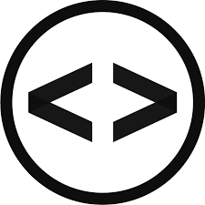

<!-- Proyect Logo -->
<div align= "center">
    <a href='https://ejercicio6-tp-dom.netlify.app/'>
    
    </a>
    <h1>Trabajo Practico N°5</h1>
    <p>
    En este repsositios encontraran ejercicios del trabajo practico N°5 con el uso de BOM y DOM
    <br>
    <a href='https://ejercicio6-tp-dom.netlify.app/'>
    <strong>Explorar pagina » </strong>
    </a>
    <br>
    <br>
    <a href='https://ejercicio6-tp-dom.netlify.app/'>
    Reportar un problema
    </a>
    ·
    <a href='https://ejercicio6-tp-dom.netlify.app/'>
    Solicitar una mejora
    </a>
    </p>
</div>

## Tabla de contenido

- [💻 Ejercicio N°6](#💻-ejercicio-n°6)
- [⚒️ Tecnologias](#⚒️-tecnologías-implementadas)
- [✅ Requisitos](#✅requisitos)
- [💿 Instalacion](#💿instalacion-y-uso)
- [🤝 Contribuir](#🤝como-contribuir)
- [👩‍💻 Autores](#👩‍💻-autores)
- [📞 Contactanos](#📞-contactanos)
- [📋 Licencia](#licencia)

## 💻 Ejercicio N°6

 Realizar una web con un temporizador donde el usuario pueda ingresar un tiempo desde donde comenzará a decrementar el contador. Debe contener los botones, iniciar, pausar y reset. 
 
## ⚒️ Tecnologías Implementadas

| Tecnologias                           | Version |
| ------------------------------------- | ------- |
| [![HTML5-badge]][HTML-url]            | **5**   |
| [![CSS3-badge]][CSS3-url]             | **3**   |
| [![BOOTSTRAP-badge]][BOOTSTRAP-url]   | **5.3** |
| [![GitHub-badge]][GitHub-url]         | -       |
| [![javaScript-badge]][javaScript-url] | -       |

## ✅Requisitos

- Windows 10 o superior
- Git
- Visual Code
- Extension "Live Server" para Visual Code

> [!IMPORTANT]
> Para que funcione el proyecto en su PC debe cumplir con **todos** los requisitos

## 💿Instalacion y uso

-Clonar repositorio:

```bash
git clone https://github.com/faustofern7/ejercicio6
```

-Asegurarse que se encuentra la rama `main`
-Ejecutar el archivo `index.html` con la extension Live Server
-Una vez instalada la aplicacion, la misma se pondra previsuar en el siguiente link `http://127.0.0.1:5500/index.html`

## 🤝Como contribuir

Para contribuir, por favor seguir los siguientes pasos:

1. Hacer un Fork del repositorio y clonarlo
2. Crear desde la rama `dev` una nueva rama para comenzar `git checkout -b nueva-rama`
3. Realizar cambios y subirlos a su fork `git push origin nueva-rama`
4. Solicitar un Pull Requeset a la rama `dev` del repositorio original

## 👩‍💻 Autores

_Fausto Fernández_

- Github: https://github.com/faustofern7
- Twitter: https://twitter.com/faustofern7

## 📞 Contactanos

| Medio    | Link                                    |
| -------- | --------------------------------------- |
| Email    | rollingCode@gmail.com                   |
| Twitter  | https://twitter.com/rollingCode         |
| Linkedin | https://www.linkedin.com/in/rollingCode |

## Licencia

codigo y documentacion copyright 2023-2024 de los autores de NEXUS. Destribuido bajo la licencia de WIT. consulte el archivo LICENSE.md para obtener mas informacion.

<!-- markdown limks & images -->

[HTML5-badge]: https://img.shields.io/badge/HTML5-E34F26?style=for-the-badge&logo=html5&logoColor=white
[HTML-url]: https://html.com/tags/
[CSS3-badge]: https://img.shields.io/badge/CSS3-1572B6?style=for-the-badge&logo=css3&logoColor=white
[CSS3-url]: https://www.w3.org/Style/CSS/
[BOOTSTRAP-badge]: https://img.shields.io/badge/Bootstrap-563D7C?style=for-the-badge&logo=bootstrap&logoColor=white
[BOOTSTRAP-url]: https://getbootstrap.com/
[GitHub-badge]: https://img.shields.io/badge/GitHub-100000?style=for-the-badge&logo=github&logoColor=white
[GitHub-url]: https://github.com/
[JavaScript-badge]: https://img.shields.io/badge/JavaScript-323330?style=for-the-badge&logo=javascript&logoColor=F7DF1E
[JavaScript-url]: https://www.javascript.com/
